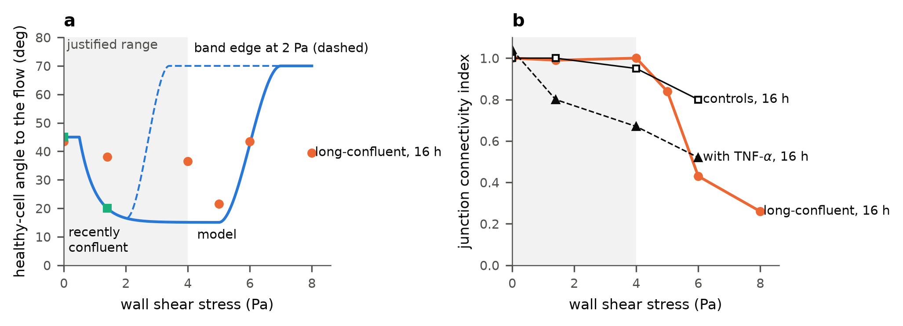

# The shear range and the limits of the conditioning protocol

The 2 Pa cap of the controller was a choice, not a limit of the chamber, so "go to
2 Pa" only reflected that choice. The range is now 0–4 Pa. Its top is set by the
monolayer, not the chamber. In the chamber of the reference data, flat HUVEC
monolayers keep full junction connectivity for 16 h up to 4 Pa and lose it above.
The chamber does not bind: it has applied 10 Pa to cells. Physiology agrees, with
arterial peaks of 2.5–4.3 Pa. The model's data end at 1.4 Pa, so everything above
that is an extrapolation, which the proposed experiment tests.

On the new range the protocol is still trivial: the controller climbs toward 4 Pa
and holds it. Only one limit with numbers changes that. If HUVEC align only up to
about 2 Pa and turn perpendicular above it (Baeyens et al. 2015), the optimum moves
inside the range, to 2 Pa. Above 2.5 Pa the model gains less than 0.5°, so the
choice of top between 2.5 and 4 Pa changes the risk to the monolayer, not the
alignment.

Code: `analysis/shear_range.py` (scenarios, design numbers, figure; results in
`results/shear_range/`), `analysis/experiment_predictions.py` (the pre-registered
predictions; results in `results/experiment_predictions/`), the configuration block
after `tau_act` in `endothelial_simulation/config.py`, and `perpendicular_weight` in
`endothelial_simulation/control/mpc_controller.py`. Every number below was checked
against its source; the index is `research/2026-09-24_limits_checked.md` in the
paper repository.

## 1. The range: which source binds

| Source | What it gives | Binds? |
|---|---|---|
| The chamber of the reference data (Chala et al. 2021; Stefopoulos et al. 2022): parallel plates, 20 mm wide, 0.3 ± 0.03 mm high, 60 mm long, τ = 6Qμ/(wh²), μ = 0.84 mPa·s, peristaltic roller pump with a compliance element | Cells exposed to 1.4–8 Pa on flat substrates and to 10 Pa on gratings for 16 h (Robotti et al. 2014); described as reaching 12 Pa (Wu et al. 2021). No pressure, pump or bubble limit is stated. 4 Pa needs 86 ml/min (Re ≈ 170, laminar); 10 Pa needs 214 ml/min (Re ≈ 420) | No |
| Bachmann et al. 2016 | A different device (flow with membrane inflation, 6 × 2.5 mm channel): design target 20 Pa, flow-only operation validated to 13 Pa | No (not the chamber of the data) |
| Physiology | Arterial 1–7 Pa, venous 0.1–0.6 Pa (Malek et al. 1999). Measured human means: carotid 1.1–1.3 Pa, brachial 0.4–0.5 Pa, femoral 0.3–0.5 Pa, coronary 0.68 Pa; peaks 2.5–4.3 Pa (Reneman and Hoeks 2008; Doriot et al. 2000) | No; 4 Pa sits at the arterial peaks |
| The model's data | The plateau was measured only at 1.4 Pa: 20° and 2.3 (Chala et al. 2021, 16 h), about 21° at 8 h (Stefopoulos et al. 2022), 11° and 3.3 at low passage (Exarchos et al. 2022) | Bounds what the model can claim. Above 1.4 Pa the targets follow the activation gate by extrapolation. The range 0–1.4 Pa is kept as a scenario |
| The monolayer, in the same chamber (flat, 16 h) | Connectivity index 1.0 up to 4 Pa, 0.84 at 5, 0.43 at 6, 0.26 at 8 Pa; density kept to 6 Pa (Robotti et al. 2014). Controls 1.0, 0.95 and 0.80 at 1.4, 4 and 6 Pa (Stefopoulos et al. 2017) | **Yes: 4 Pa** |

The chamber's height tolerance matters at the top. The stated shear is
1.4 ± 0.2 Pa (±14 %), so a set point of 4 Pa may reach 4.6 Pa, where connectivity
starts to fall. A set point of 3.5 Pa keeps the upper tolerance at 4 Pa and costs
less than 0.1° in the model (section 3). This is a choice for Guido.

*(a) The healthy-cell target of the model against shear (solid), with the band edge
at 2 Pa (dashed), long-confluent monolayers after 16 h (circles; Robotti et al. 2014)
and recently confluent ones (squares; Chala et al. 2021, Stefopoulos et al. 2022).
(b) Junction connectivity after 16 h in the same chamber: long-confluent monolayers
(Robotti et al. 2014), and controls and monolayers with circulating TNF-α
(Stefopoulos et al. 2017). Shaded: the range.*

## 2. The candidate limits

A limit enters the model only where the literature gives numbers for it.

| Candidate | Numbers in the literature | Used as |
|---|---|---|
| Gaps after flow starts, step against ramp | A step opens a transient weakening that recovers within hours: resistance down 20 % during the shape change, with no gaps up to 5 Pa (Seebach et al. 2000); hydraulic conductivity back to baseline by 2 h (Pang et al. 2005); albumin permeability nearly doubled 40 min after the mean shear stepped from 1.5 to 3 Pa (Zhang and Friedman 2012); hydraulic conductivity of bovine cells 3.76–4.70× at 3 h at 2 Pa (Sill et al. 1995; Chang et al. 2000). No barrier data compare step and ramp. A ramp removes the NO burst and the MCP-1 induction of a step, leaves a minor PDGF-A rise, and removes the proliferation; for the last a 30 s ramp suffices (Frangos et al. 1996; Bao et al. 1999; White et al. 2001) | Not a limit: the effect is transient, and any ramp longer than a minute avoids the signalling response. It sets the gap bounds at 1 h in the predictions (flow/static 1–2×) |
| Gaps by senescent share | Static only: senescent monolayers pass 2.5× more Lucifer Yellow; mixtures of senescent and young cells 1.5× Lucifer Yellow and 3.5× peroxidase (Krouwer et al. 2012). Under flow, only inflamed monolayers: with circulating TNF-α, connectivity is 0.80 at 1.4 Pa, 0.67 at 4 Pa and 0.52 at 6 Pa (Stefopoulos et al. 2017). A1: flow/static gap ratio 1.0 and 3.8 at 1.4 Pa, 6 h | A sensitivity on the top: between 1.4 Pa, if the 30 % mixture behaves like an inflamed monolayer, and 4 Pa, if it behaves like the controls. The scenario "calibrated shear only" is the low end. It also sets the gap bounds of the predictions. The A1 senescent cells were made with TNF-α, but they are not the same condition as circulating TNF-α |
| Detachment by shear | Confluent monolayers stay attached: bovine cells at 10 Pa for 24 h (Dolan et al. 2012); density kept to 6 Pa in the chamber (Robotti et al. 2014). Cells on glass after 3 or 24 h of adhesion: retention 85 to 20 % at 8.8 to 26 Pa for 2 h (van Kooten et al. 1994). Porcine valve cells on flat polyethylene lose half their coverage at 3.3 Pa over 48 h (Ibrahim et al. 2026, preprint) | Not a limit in the range for confluent HUVEC in this chamber. The preprint concerns other cells and another substrate |
| Detachment by ramp | Grafts seeded and conditioned over days: linear against stepwise increase to 0.9 Pa keeps 85 against 3 % of HUVEC (McIlhenny et al. 2010); preconditioned grafts lose about 130× fewer cells at 2.5 Pa (Ott and Ballermann 1995) | Concerns fresh seeding over days, not a confluent monolayer; relevant for the device (objective C), not the chamber protocol |
| Detachment by senescence | No study under shear. Senescent HUVEC adhere more strongly to the substrate: 341–887 against 217 nN (vertical pull; Chala et al. 2021) | No numbers; the experiment's gap and density readouts answer it |
| Responses above 2 Pa | Alignment only at about 1–2 Pa after 16 h, misaligned or perpendicular outside (Baeyens et al. 2015, gradient chamber). Perpendicular (about 90°) at 8 Pa in the same chamber (Stefopoulos et al. 2022). Long-confluent monolayers aligned best at 5 Pa and lost it at 6 Pa (Robotti et al. 2014). Apoptosis: laminar shear protects at 1.5 and 3 Pa (Bartling et al. 2000); raised only at 28.4 Pa (Dolan et al. 2011) | The perpendicular state of the model: band top 5 Pa, crossover 6 Pa (reported); band top 2 Pa, crossover 2.7 Pa (sensitivity). No apoptosis limit in the range |
| Raising the shear on an adapted monolayer | Aligned at 1.4 Pa, then 8 Pa: no perpendicular state, holes, VE-cadherin in the cytoplasm (Stefopoulos, thesis ch. 5; Stefopoulos et al. 2022) | Only above the range. A constraint on what an adapted monolayer may meet on the device later; no numbers within 0–4 Pa |
| Shear over the device (CFD) | HVAD inflow cannula: 18–33 % of the surface below 0.3 Pa, 59–72 % at 0.3–9 Pa, 8–10 % above 9 Pa (Ghodrati et al. 2020); up to 28.3 Pa at an idealised cannula tip (Ong et al. 2013); only the outlet tube of a HeartMate III-like pump below 10 Pa (Selgrade and Truskey 2012); aortic wall up to 15.3 Pa (Sahni et al. 2023) | Not a limit on the chamber protocol. The device exposes parts of its surface to more than a flat monolayer tolerates (4 Pa); textured substrates keep connectivity to 10 Pa (Robotti et al. 2014) |

## 3. The controller on the range

Twelve one-hour steps, N_p = 6, N_c = 3, 30 % senescent cells, master seed
(`python -m analysis.shear_range`). The paper run of the full model
(`python -m endothelial_simulation.run_mpc --steps 12`, `results/paper_run/20260924-range4/`)
gives the same inputs to three decimals.

| Scenario | τ(k), Pa (hours 1–6; 7–12) | ρ̄, 6 h | Healthy, 6 h / 12 h | Population, 6 h / 12 h |
|---|---|---|---|---|
| **Reported: range 0–4 Pa** | 1.89, 2.54, 2.90, 3.15, 3.32, 3.46; 3.57 … 3.93 | 2.22 | 19.3° / 15.7° | 27.1° / 24.5° |
| Band edge at 2 Pa (Baeyens et al. 2015) | 1.78, then 2.01–2.02 | 2.21 | 20.4° / 17.0° | 27.8° / 25.5° |
| Calibrated shear only: range 0–1.4 Pa | 1.40 throughout | 2.17 | 23.4° / 20.5° | 29.9° / 27.9° |
| Set point 3.5 Pa (tolerance kept below 4 Pa) | as reported to hour 5, then 3.42, 3.48, 3.50 | 2.22 | 19.3° / 15.7° | 27.1° / 24.5° |
| Ramp limit 0.5 Pa h⁻¹ | 0.50, 1.00, 1.50, 2.00, 2.50, 2.87; 3.11 … 3.73 | 2.18 | 22.4° / 16.1° | 29.2° / 24.8° |
| Dense monolayer (T_adapt = 6 h) | 1.81, 2.45, 2.81, 3.04, 3.22, 3.35; 3.46 … 3.80 | 2.14 | 26.3° / 19.2° | 32.0° / 27.0° |
| Inherited fraction 0.20 | 1.92, 2.57, 2.93, 3.17, 3.34, 3.47; 3.58 … 3.94 | 2.25 | 19.3° / 15.7° | 24.5° / 21.6° |
| Bound at 8 Pa; also without the perpendicular state | as reported | 2.22 | 19.3° / 15.7° | 27.1° / 24.5° |

- **Still trivial.** The input climbs monotonically toward the top. Nothing in the
  cost counts against shear, and none of the limits with numbers is a trade-off: each
  is a bound.
- **The pace of the climb is the move penalty.** The first move goes to 1.9 Pa, not
  to 4 Pa, because w_u prices the step and the extrapolated gain is small (16.5° at
  2 Pa, 15.1° at 4 Pa). The shape of the climb is therefore a property of the
  regulariser, not of the cells.
- **What changes it is the band edge.** If alignment stops at 2 Pa, the optimum is
  inside the range, at 2 Pa, set by the cells. A chamber bound at 8 Pa, or a model
  without the perpendicular state, changes nothing within 12 h: the controller never
  reaches the band top of 5 Pa.
- **At 12 h the range buys 3.4° over 1.4 Pa** for the population (24.5° against
  27.9°). This is the extrapolated part of the result.

## 4. The design numbers at 1.4 Pa and at the top

The healthy-cell plateau along the gate (floor 11°, the lowest measured in this
chamber):

| τ_act | 1.4 Pa | 2 Pa | 2.5 Pa | 3 Pa | 3.5 Pa | 4 Pa |
|---|---|---|---|---|---|---|
| 0.5 Pa (nominal) | 20.0° | 16.5° | 15.6° | 15.2° | 15.1° | 15.1° |
| 0.3 Pa | 20.0° | 19.4° | 19.4° | 19.3° | 19.3° | 19.3° |
| 0.7 Pa | 20.0° | 11.6° | 11.0° | 11.0° | 11.0° | 11.0° |

**Acceptance threshold.** The population plateau is
(1 − φ_sen)·θ*(τ) + φ_sen·45°, so the largest senescent share for a target is
(target − θ*)/(45° − θ*):

| Population target | 1.4 Pa | 4 Pa, nominal | 4 Pa, τ_act 0.3–0.7 |
|---|---|---|---|
| 22.5° | 10 % | 25 % | 12–34 % |
| 25° | 20 % | 33 % | 22–41 % |
| 27.5° | 30 % | 42 % | 32–49 % |
| 30° | 40 % | 50 % | 42–56 % |

At 1.4 Pa the threshold rests on measured values. At 4 Pa it rests on the
extrapolation, and its spread is that of the unmeasured activation shear.

**Conditioning time.** The adaptation constant does not depend on shear in the
model, so the times are the same at 4 Pa as at 1.4 Pa: 90 and 95 % of the change
take 6.9 and 9.0 h with T_adapt = 3 h, 4.6–9.2 and 6.0–12.0 h over 2–4 h, 13.8 and
18.0 h for a monolayer that adapts twice as slowly (6 h), and up to 27.6 and 35.9 h with the slowest
HUVEC kinetics reported (12 h). Under a 4 Pa step, a 30 % mixture is at 26.9° after
6 h and 24.1° after 24 h (29.9° and 27.5° at 1.4 Pa).

## 5. The proposed experiment

`paper_mthesis/EXPERIMENT_PREDICTIONS.md` holds the pre-registered predictions and
how to compare against them. The design has HUVEC monolayers with 0 and 30 %
senescent cells, a step or a 30-min ramp, 1.4 and 4 Pa, fixation at 1, 6 and 24 h,
and static controls of each share. The table gives alignment, aspect ratio and gap
area with two bands: the model over its parameter ranges, and the same with the
slower kinetics of other HUVEC studies. Three hypotheses for the response above
1.4 Pa are compared:

- **The model:** 4 Pa aligns 4.9° better than 1.4 Pa at 24 h (young cells;
  band 0.3–9.5°).
- **Band edge at 2 Pa:** cells at 4 Pa sit 50° further from the flow (70° against
  20° at 1.4 Pa).
- **Long-confluent monolayers:** 1.5° better, and little alignment at either shear
  (38–39° after 6 h). A1 sits on this curve: 41.6 ± 7.1° per field after 6 h at 1.4 Pa, against
  40.8° predicted.

The 4 Pa arm separates the hypotheses with a few fields. The model's own gain of
5° needs at least 33 fields per arm (the A1 spread of 7.1° between fields).
`python -m analysis.experiment_predictions compare --measured fields.csv` reports
each condition against the bands and fits the adaptation constant from the time
course.

## 6. Questions the papers cannot answer

For Nafsika:

1. **Chambers in parallel.** How many chambers can run at once, and from one pump
   or several? The design has 24 flow slides and 6 static ones. If 1.4 and 4 Pa can
   run side by side on the same cell batch, their difference is paired.
2. **Free fluorescence channels.** A1 used DAPI, β-catenin (green) and the Golgi
   (red). Is a far-red channel free? It could carry VE-cadherin (the connectivity
   index of the reference data), a senescence marker (p21 or p16), or a CellTracker
   label on the TNF-α-treated cells before seeding. The label would identify the
   senescent cells directly rather than by size. Could the spinning disk be in the
   light path (A1 was widefield)?
3. **Live imaging.** Can a chamber sit on a microscope stage under flow? Then one
   chamber gives the whole time course, and detachment directly, instead of three
   fixed slides.
4. **Seeding density and days since confluence.** A1 held 620–720 cells/mm²,
   1.1–1.6× Chala's (corrected: the A1 pixel is 0.650 µm, not the recorded 0.429 µm,
   which had given 1,420–1,660). Stefopoulos et al. seeded 350–500 cells/mm² for three
   days. Long-confluent monolayers align slowly (38° after 16 h at 1.4 Pa in
   Robotti et al. 2014). What density can be set, and can it be held the same across
   arms?
5. **The pump.** Can it deliver 86 ml/min through one chamber for 24 h (4 Pa), and
   ramp over 30 min rather than step?
6. **The cells.** Passage and population doublings ("H_P3" in the file names). The
   1.4 Pa plateau is 11° at low passage and 44° at 17 population doublings
   (Exarchos et al. 2022). Also the TNF-α dose and schedule, whether it is washed out
   before seeding, and whether senescence is checked (SA-β-gal, p21).
7. **The substrate.** The file names say "FlatA", flat by assumption. What were the
   A1 patches made of and coated with? Textured substrates tolerate 10 Pa.
8. **The A1 flow duration.** 6 h by the thesis; the notes date each run over two
   days.
9. **The chamber.** Did A1 run in the parallel-plate chamber of Chala et al. 2021
   and Stefopoulos et al. 2022 (20 × 0.3 × 60 mm)? The paper cited Bachmann et al.
   2016 for it, which describes a different device (flow with membrane inflation,
   6 × 2.5 mm channel).

For Guido:

10. **The set point at the top:** 4 Pa, or 3.5 Pa so that the ±14 % tolerance stays
   at or below 4 Pa?
11. **The population target** that defines acceptance (22.5–30°).
